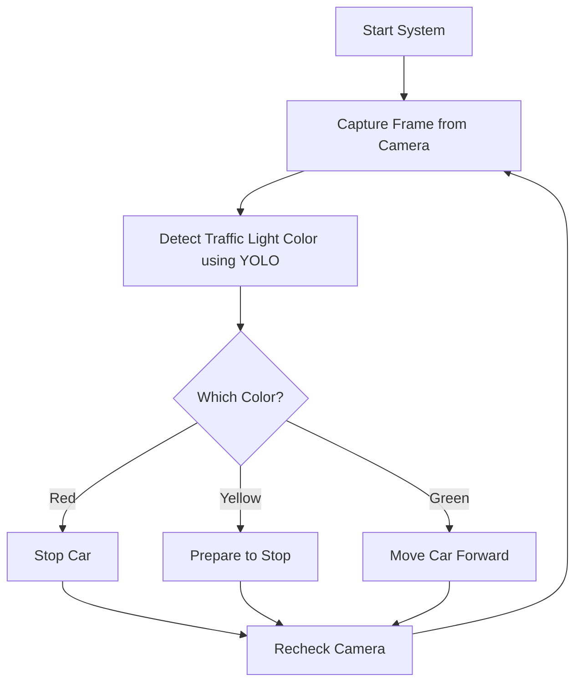

## Smart Traffic Light Detection System

This is an AI-based smart traffic light detection system that helps control a vehicle's movement based on traffic signal recognition. The system uses a Raspberry Pi, a camera, and a YOLO model to detect the color of the traffic light (Red, Yellow, Green), and then it either moves or stops the vehicle using a servo motor.

---

# Features

- Real-time detection of traffic light colors using YOLOv8
- Automatic control of vehicle movement (stop/go)
- Modular code with hardware integration
- Optional Flask backend for web monitoring

---

# System Flow



# Project Structure

```bash
Smart_Traffic_Light_Detection/
│
├── camera.py          # Captures video from camera
├── detect_traffic.py  # Contains YOLOv8 model loading and traffic light detection code
├── vehicle_control.py # Controls the servo motor based on light color
├── app.py             # Optional Flask backend for monitoring
├── requirements.txt   # Python dependencies
├── templates/
│   └── index.html     # Frontend for Flask
└── README.md          # Project description and setup instructions

```
---------------------------------------------------------------------------------------
# Setup Instructions

Hardware Required : 

- Raspberry Pi (with GPIO support)
- USB Camera or Pi Camera
- Servo Motor
- Breadboard & Jumper Wires
- Power Supply or Battery
- (Optional) LEDs for status display

--------------------------------------------------------------------------------
# Software Installation

requirements.txt:
   
This file lists all the dependencies.

flask
opencv-python
torch
torchvision
RPi.GPIO


Install dependencies:
                    
                      pip install -r requirements.txt
How to Run
Run the main system:
                       
                       python main.py
                       
Connect your camera and servo motor to the Raspberry Pi.

Run Flask backend (optional):
                       
                       python app/routes.py
                       
Visit the web interface at:
                       
                       http://localhost:5000

---------------------------------------------------------------------------------------------------------------
# How It Works

- The camera captures video frames.
- The YOLOv8 model detects traffic light color in real time.
- The system makes a decision:
- Red: Stop the car
- Yellow: Prepare to stop
- Green: Move the car

GPIO pins are triggered to control the servo motor.

