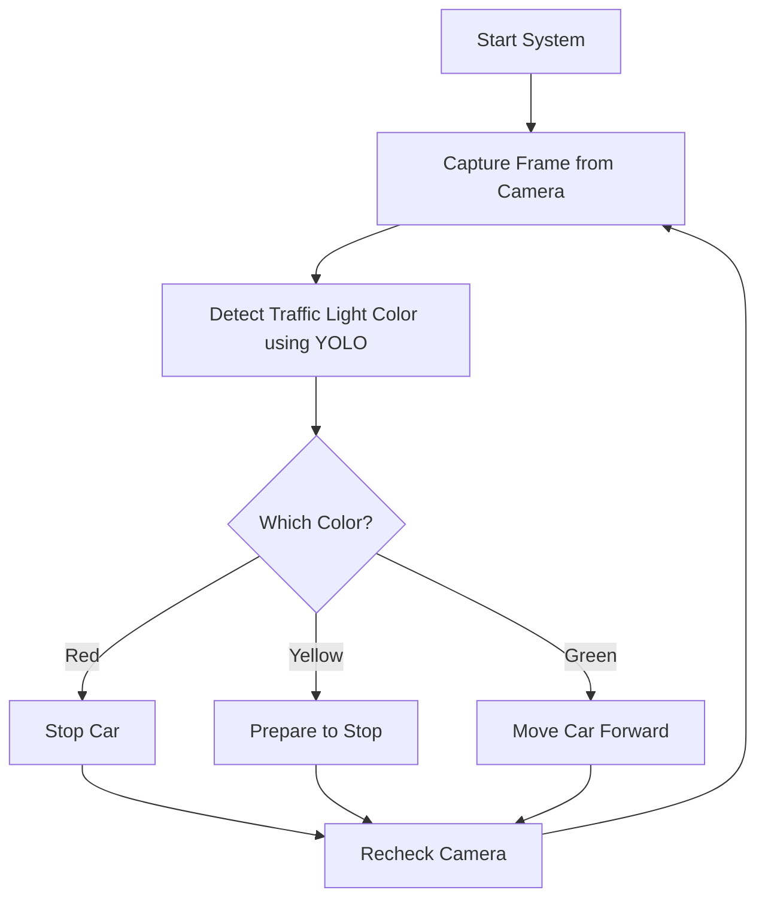

# 🚦 Smart Traffic Light Detection System

This is an AI-based smart traffic light detection system that helps control a vehicle's movement based on traffic signal recognition. The system uses a Raspberry Pi, a camera, and a YOLO model to detect the color of the traffic light (Red, Yellow, Green), and then it either moves or stops the vehicle using a servo motor.

---

## 📌 Features

- Real-time detection of traffic light colors using YOLOv8
- Automatic control of vehicle movement (stop/go)
- Modular code with hardware integration
- Optional Flask backend for web monitoring
- Ideal for smart mobility and educational projects

---

## 🧠 System Flow



🗂️ Project Structure

```bash
traffic_light_project/
│
├── app/                     
│   ├── __init__.py           # Initialize Flask app
│   ├── routes.py             # Flask routes (web interface)
│   └── controller.py         # Logic to handle detection and control
│
├── model/                   
│   └── traffic_light_model.py # YOLO-based traffic light detection
│
├── hardware/                
│   └── car_controller.py      # GPIO-based motor control
│
├── templates/                
│   └── index.html             # Frontend (if using Flask UI)
│
├── static/                   # Static assets like CSS/JS
│
├── main.py                   # Entry point to run the system
├── requirements.txt          # List of dependencies
└── README.md                 # This file
```
---------------------------------------------------------------------------------------
⚙️ Setup Instructions
🧰 Hardware Required
Raspberry Pi (with GPIO support)

USB Camera or Pi Camera

Servo Motor

Breadboard & Jumper Wires

Power Supply or Battery

(Optional) LEDs for status display
--------------------------------------------------------------------------------
🧪 Software Installation

Install dependencies:
                    
                      pip install -r requirements.txt
▶️ How to Run
Run the main system:
                       
                       python main.py
                       
This starts the camera, detects signals, and controls the car.


Run Flask backend (optional):
                       
                       python app/routes.py
                       
Then open your browser and go to http://localhost:5000/ to view the dashboard.


---------------------------------------------------------------------------------------------------------------
🔍 How It Works
The camera captures video frames.

The YOLOv8 model detects traffic light color in real time.

The system makes a decision:

Red: Stop the car

Yellow: Prepare to stop

Green: Move the car

GPIO pins are triggered to control the servo motor.

-------------------------------------------------------
🚀 Future Scope
Add distance estimation using ultrasonic sensors

Integrate a mobile app for remote monitoring

Use cloud dashboard for city-wide traffic management

Add lane detection and pedestrian recognition


